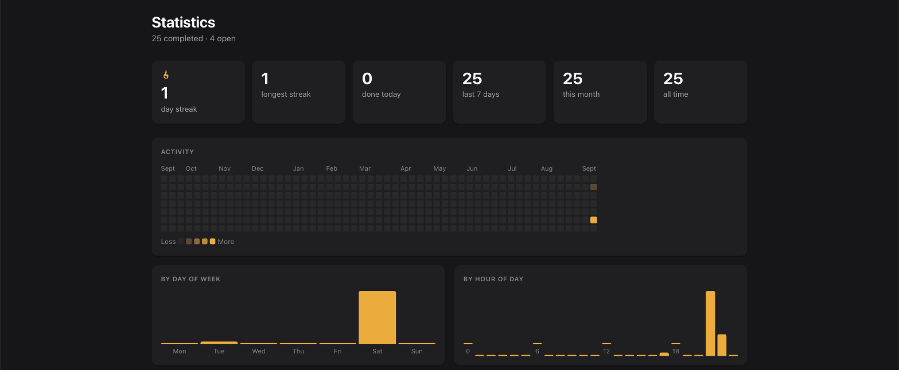

# Waddle

A self-hosted Todoist alternative that talks to Claude natively: task management as an MCP server, not just a web app. Built by [Fraai Agency](https://fraai.agency), a web studio in Flanders, and used daily by the team in production since it shipped.



Astro SSR on Cloudflare Workers, D1 for storage, Google/GitHub/Microsoft SSO restricted to one domain of your choosing (no forking required, see below). Runs comfortably on Cloudflare's free tier for a small team, so self-hosting costs $0 where a per-seat SaaS plan doesn't.

## Why this instead of Todoist/Things/Linear's task view

- **It's an MCP server first.** `/api/mcp` exposes the same tasks to Claude Code, Claude Desktop, or a custom connector, which can list, create, and complete them. Ask Claude what's due today, or have it file a task mid-conversation, without switching apps. No other open-source todo app does this natively.
- **You own the data.** Cloudflare D1 in your own account, not a third party's database.
- **It's not a toy.** Recurring tasks, real Web Push notifications (works with the app fully closed), drag-and-drop, subtasks, and a statistics page with a GitHub-style completion heatmap. These are the things a team actually asks for after a week of daily use, not launch-day extras.

## Features

- **Today / Upcoming / Week views.** Overdue and due-today tasks, a rolling agenda grouped by date, and a 7-day board you can drag tasks across.
- **Projects**, personal to each user and marked private or work (filterable from the sidebar), with a colour you can set per project and a readable URL (`/app/projects/fitness`, not `/app/projects/7`). Every user gets an un-renameable, un-deletable Inbox on first login.
- **Favorites and one level of nesting.** Star a project to also show it in a "Favorites" section above the main list; group related projects under a parent (one level deep, no grandchildren). Edit everything about a project, including its parent, from a single modal.
- **Sections, subtasks, descriptions, links, recurring tasks.** Sections group tasks within a project (drag to reorder); tasks can have subtasks, a free-text description, a link, and a repeat rule, all editable from a detail modal.
- **Push notifications.** A task with a due date and time sends a real Web Push notification, even with the app closed.
- **Statistics**: completion streaks, a GitHub-style activity heatmap, and breakdowns by project, priority, day, and hour.
- **Installable.** Has a manifest and icons, so it can be added to your home screen (iPhone/iPad) or dock (Mac) as a standalone app.
- **Keyboard-accessible, not just drag-and-drop.** Reordering projects, favorites, tasks, and sections all have a "move up"/"move down" button alongside the drag handle, sidebar navigation has proper landmarks, and there's a skip-to-content link.
- **Timezone and date format are config, not code.** Defaults match this instance's own team (Belgium); running it somewhere else is one env var, not a fork.
- **MCP server.** `/api/mcp` exposes the app to Claude (Code, Desktop, or a custom connector) as tools for listing, creating, and completing tasks and projects. See `CLAUDE.md` for the tool list and setup.

## Deploying your own instance

No prior Cloudflare experience needed: every piece is explained as you hit it. About 15-20 minutes, almost all of it waiting on web forms, not code.

**What you'll need**, all free:
- A [Cloudflare account](https://dash.cloudflare.com/sign-up). This is where the app actually runs (Cloudflare Workers is their serverless hosting; think "Vercel/Netlify, but also gives you a free database").
- A [Google Cloud](https://console.cloud.google.com) account, only used to create the "Sign in with Google" credential, nothing else.
- Node.js 22+ installed locally.

### 1. Get the code and log in to Cloudflare

```bash
git clone <this-repo-url>
cd <cloned-directory>   # whatever git named the folder it just created
npm install
npx wrangler login   # opens your browser to connect this CLI to your Cloudflare account
```
`wrangler` is Cloudflare's command-line tool for deploying and configuring Workers. It's already installed as part of `npm install`, so there's nothing extra to set up.

### 2. Create your own database and session store

This app needs two Cloudflare resources under your own account. This repo's `wrangler.toml` points at Fraai Agency's own database, which you don't have access to, so you'll create your own (also free):

```bash
npx wrangler d1 create todo-app
npx wrangler kv namespace create SESSION
```

- **D1** is Cloudflare's hosted SQL database (think "free hosted SQLite"). Every project and task lives here.
- **KV** is a simple key-value store, used only to remember who's logged in.

Each command prints a block of TOML like this. Copy the `database_id` (from the first command) and `id` (from the second) into `wrangler.toml`, replacing the existing values on those same lines:

```toml
database_id = "xxxxxxxx-xxxx-xxxx-xxxx-xxxxxxxxxxxx"   # from `wrangler d1 create`
id = "xxxxxxxxxxxxxxxxxxxxxxxxxxxxxxxx"                # from `wrangler kv namespace create`
```

Also change `name` at the top of `wrangler.toml` to whatever you want your Worker called. There's no custom domain configured, on purpose: `npm run deploy` gives your Worker a free URL like `todo-app.<your-subdomain>.workers.dev` the moment you deploy, which is good enough to actually use. Want a real domain instead? Set it via an environment variable at deploy time, not in the file: `WORKER_DOMAIN=your-domain.com npm run deploy`.

### 3. Set up sign-in

Google is required; GitHub and Microsoft are optional extra sign-in buttons. Set up only what you want to offer, using your actual `workers.dev` URL from step 2 wherever you see `<your-app>`.

**Google**: in [Google Cloud Console](https://console.cloud.google.com/apis/credentials), create a project if you don't have one, then **Create Credentials → OAuth client ID → Application type: Web application**. Add these under "Authorized redirect URIs":
- `https://<your-app>.<your-subdomain>.workers.dev/api/auth/callback`
- `http://localhost:4321/api/auth/callback`

**GitHub** (optional): in GitHub → Settings → Developer settings → OAuth Apps → New OAuth App, set the callback URL to `https://<your-app>.<your-subdomain>.workers.dev/api/auth/callback/github`.

**Microsoft** (optional): in the Azure Portal → Entra ID → App registrations → New registration, add a Web redirect URI: `https://<your-app>.<your-subdomain>.workers.dev/api/auth/callback/microsoft`.

Each one gives you a client ID and client secret, needed in the next step.

### 4. Configure secrets

Copy `.env.example` to `.dev.vars` and fill in real values: the Google client ID/secret from step 3, a random 32+ character string for `JWT_SECRET`, and your own email's domain for `ALLOWED_EMAIL_DOMAIN` (this is what restricts sign-in to your organization, for every provider). Add `AUTH_GITHUB_ID`/`AUTH_GITHUB_SECRET` and/or `AUTH_MICROSOFT_ID`/`AUTH_MICROSOFT_SECRET` only if you set those up in step 3; leaving a pair unset just hides that provider's button. See the comments in that file and `CLAUDE.md` for what everything else does; most of it is optional.

`.dev.vars` only covers your local machine. For the live deployment, push each one individually. This prompts you to paste the value; it doesn't take it as a command argument:
```bash
npx wrangler secret put JWT_SECRET
npx wrangler secret put AUTH_GOOGLE_ID
npx wrangler secret put AUTH_GOOGLE_SECRET
npx wrangler secret put ALLOWED_EMAIL_DOMAIN
# Optional, only if you set up GitHub and/or Microsoft sign-in:
npx wrangler secret put AUTH_GITHUB_ID
npx wrangler secret put AUTH_GITHUB_SECRET
npx wrangler secret put AUTH_MICROSOFT_ID
npx wrangler secret put AUTH_MICROSOFT_SECRET
```

### 5. Run it

```bash
npm run db:migrate:local
npm run dev
```
Open `http://localhost:4321` and sign in. When you're ready to put it online for real:
```bash
npm run db:migrate:remote   # applies the database schema to your live D1 database
npm run deploy              # builds and deploys the Worker
```
Wrangler prints your live URL when this finishes.

## Commands

```bash
npm run dev               # Astro dev server on http://localhost:4321
npm run build              # Production build
npm test                   # Vitest unit + DB tests (local D1, no Cloudflare account needed)
npx wrangler dev            # Preview against a Cloudflare Worker runtime locally
npm run deploy             # Build and deploy to Cloudflare
npm run db:migrate:local   # Apply migrations to the local D1 database
npm run db:migrate:remote  # Apply migrations to production
```

See `CLAUDE.md` for architecture, the full list of required secrets, and the MCP tool reference.

## Why "Waddle"

Getting your ducks in a row is the whole point of a task list. The name's the idiom, the pace is the point: steady, one task at a time, rather than everything at once.

## License

MIT, see [LICENSE](LICENSE).

---

Built by [Fraai Agency](https://fraai.agency). We build and host Astro sites for clients in Flanders; this is one of our own internal tools, open-sourced as-is.
